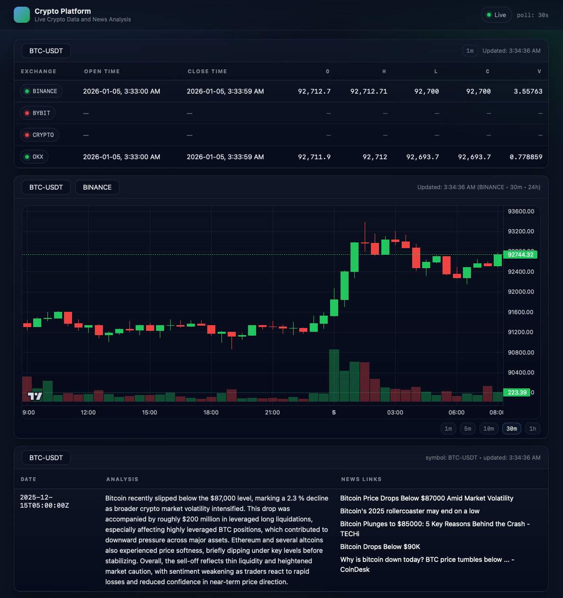
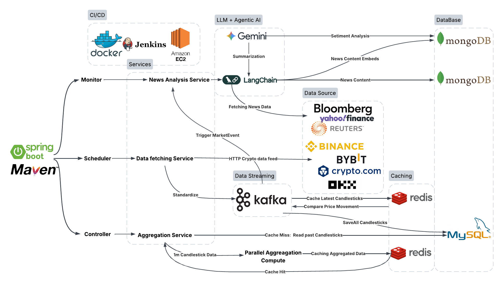
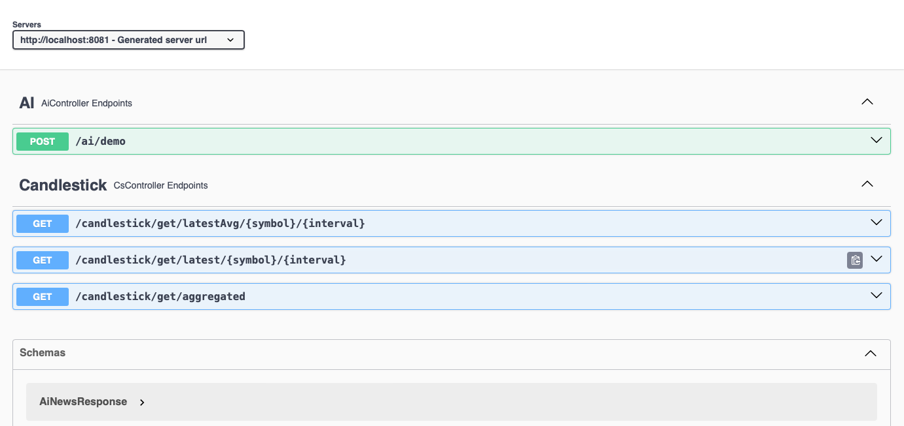

# Crypto-platform

Crypto-Platform is a scalable Spring Boot–based backend for real-time cryptocurrency market data ingestion and analysis.
It standardizes OHLCV data from multiple exchanges, supports high-throughput aggregation and event detection via Kafka 
and Redis. It also integrates a RAG pipeline where scraped news articles are stored in MongoDB and indexed as semantic 
embeddings for reference and similarity searching, which enables LLMs to explain abnormal market movements. 
Comprehensive unit and integration tests are included to ensure correctness and reliability, and a CI/CD pipeline is 
implemented to automatically build, package, and deploy the application to AWS EC2 via Jenkins and Docker. The system 
is designed for low-latency access, horizontal scalability, and extensibility toward quantitative trading and market 
research applications.

# Demo


# Architecture


## Endpoints

### Backend:
#### LatestAvgCandlesticks
**GET** `/candlestick/get/latestAvg/{symbol}/{interval}`

Get the averaged OHLCV of the latest candlestick across exchanges for a symbol at a given interval.

**Path params:**
- `symbol` (e.g., BTC-USDT)
- `interval` (e.g., 1m, 5m, 1h)

**Returns:** `Candlestick`

#### LatestCandlesticks
**GET** `/candlestick/get/latest/{symbol}/{interval}`

Get the latest candlestick per exchange for a symbol at a given interval.

**Path params:**
- `symbol`
- `interval`

**Returns:** `Map<String, Candlestick>` (keyed by exchange, e.g., BINANCE, OKX, …)

#### AggregateCandlesticks
**GET** `/candlestick/get/aggregated`

Get historical candlesticks aggregated to a coarser interval for a symbol from a specified exchange, within a time range.

**Query params (via `CsRequest`):**
- `exchange`
- `symbol`
- `interval`
- `openTime`
- `closeTime`
- `limit`

**Returns:** `List<Candlestick>`

---

### AI:

#### ReasonMarketEvent
**POST** `/ai/demo?symbol={symbol}`

Runs a demo market-event reasoning flow: looks up stored news history (MongoDB) and asks the LLM to generate a summary.

**Query params:**
- `symbol` (e.g., BTC-USDT)

**Returns:** `AiNewsResponse` (`symbol`, `summary`, `linksByTitle`, `timestamp`)

## How to run the app
### Step 1: Create .env
Create a .env file under the project root directory.
And configure your own api keys and connection credentials.

```
SPRING_DATASOURCE_URL=jdbc:mysql://<RDS_ENDPOINT>:3306/crypto_platform?useSSL=false&serverTimezone=UTC
SPRING_DATASOURCE_USERNAME=<MYSQL_USERNAME>
SPRING_DATASOURCE_PASSWORD=<MYSQL_PASSWORD>

SPRING_DATA_MONGODB_URI=mongodb+srv://<USERNAME>:<PASSWORD>@<CLUSTER>.mongodb.net/crypto_platform

GEMINI_API_KEY=<YOUR_GEMINI_API_KEY>
TAVILY_API_KEY=<YOUR_TAVILY_API_KEY>
```

### Step 2: Install tools
#### Option 1: Manually Download each Tool
| Tool    | Version | Download                                                                         |
|---------|---------|----------------------------------------------------------------------------------|
| JDK     | 17      | https://download.oracle.com/java/17/archive/jdk-17.0.10_macos-aarch64_bin.tar.gz |
| Kafka   | 4.1.1   | Homebrew: `brew install kafka`                                                   |
| MySQL   | 8.0.42  | AWS RDS                                                                          |
| Redis   | 8.4.0   | Homebrew: `brew install redis`                                                   |
| MongoDB | 8.0.17  | MongoDB Atlas (managed cluster)                                                  |
| Docker  | 29.1.2  | https://www.docker.com/products/docker-desktop/                                  |
| Jenkins | 2.543   | Homebrew: `brew install jenkins` or Host Jenkins on AWS EC2                      |

#### Option 2: Docker
From the project root directory:
`docker compose up -d`
This starts required infrastructure services (e.g., Kafka, Redis) in detached mode.

### Step 3: Initiate Database Schema
The project includes a MySQL initialization script that creates the database schema
and inserts required seed data.

The SQL file is located at: crypto-platform/document/sql/crypto_platform.sql

#### Run via MySQL CLI
```bash
   mysql -h <RDS_ENDPOINT> -P 3306 -u <MYSQL_USERNAME> -p < crypto-platform/document/sql/crypto_platform.sql
```

### Step 4: Run the App
#### Option 1: Run with Maven
`mvn clean spring-boot:run`

#### Option 2: Package and Run as JAR
```
mvn clean package
java -jar target/crypto-platform-0.0.1-SNAPSHOT.jar
```

### Step 5: Verify the Application
- API available at:
http://localhost:8081
- Swagger UI:
http://localhost:8081/swagger-ui.html


## Copyright

© 2025–2026 **Haoning Jin**  
All rights reserved.

**Contact:** medivhjin@gmail.com